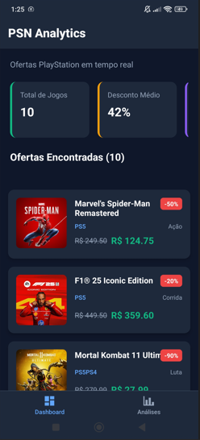
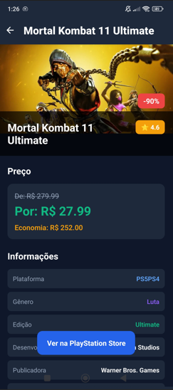
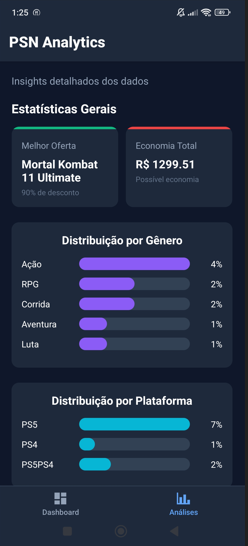

# PSN Dashboard App - React Native

Um aplicativo React Native para visualizar ofertas da PlayStation Store com gráficos e análises detalhadas.

  

## 📱 Sobre o Aplicativo

Este aplicativo foi desenvolvido em React Native usando Expo e apresenta:

- **Dashboard principal** com lista de jogos em promoção
- **Tela de análises** com gráficos e estatísticas
- **Detalhes dos jogos** com informações completas
- **Dados fictícios** simulando uma API real
- **Design inspirado no tema PlayStation** (azul escuro/roxo)

## 🚀 Tecnologias Utilizadas

- **React Native** - Framework para desenvolvimento mobile
- **Expo** - Plataforma para desenvolvimento React Native
- **React Navigation** - Navegação entre telas
- **JavaScript ES6+** - Linguagem de programação

## 📁 Estrutura do Projeto

```
PSNDashboardApp/
├── App.js                     # Componente principal com navegação
├── components/                # Componentes reutilizáveis
│   └── GameCard.js           # Card de exibição de jogos
├── screens/                   # Telas do aplicativo
│   ├── DashboardScreen.js    # Tela principal com lista de jogos
│   ├── AnalyticsScreen.js    # Tela de análises e gráficos
│   └── GameDetailsScreen.js  # Tela de detalhes do jogo
├── data/                     # Dados fictícios e simulação de API
│   └── mockData.js          # Dados dos jogos e funções de API
├── package.json             # Dependências do projeto
└── README.md               # Este arquivo
```

## 🎮 Funcionalidades

### Dashboard Principal

- Lista de jogos em promoção
- Cards com informações de preço e desconto
- Estatísticas gerais (total de jogos, desconto médio, etc.)
- Pull-to-refresh para atualizar dados
- Navegação para detalhes do jogo

### Tela de Análises

- Gráficos de distribuição por gênero
- Gráficos de distribuição por plataforma
- Análise de faixas de desconto
- Evolução de preços ao longo do tempo
- Top jogos por avaliação
- Estatísticas detalhadas

### Detalhes do Jogo

- Informações completas do jogo
- Cálculo de economia
- Dados do desenvolvedor e publicadora
- Avaliação e estatísticas
- Botão para acessar a PlayStation Store

## 📊 Dados Fictícios

O aplicativo utiliza dados fictícios que simulam:

- **10 jogos** com informações completas
- **Preços originais e com desconto**
- **Plataformas** (PS5, PS4, PS5PS4)
- **Gêneros** (Ação, RPG, Corrida, Aventura, Luta)
- **Avaliações e metadados**
- **Estatísticas para gráficos**

### Estrutura dos Dados

Cada jogo contém:

```javascript
{
  id: 1,
  title: "Nome do Jogo",
  platform: "PS5",
  genre: "Ação",
  original_price: 249.50,
  discounted_price: 124.75,
  discount_percentage: 50,
  edition_type: "Standard",
  image_url: "URL da imagem",
  rating: 4.8,
  release_date: "2022-08-12",
  description: "Descrição do jogo",
  developer: "Desenvolvedor",
  publisher: "Publicadora"
}
```

## 🛠️ Como Executar

### Pré-requisitos

- Node.js instalado
- npm ou yarn
- Expo CLI (opcional, mas recomendado)

### Instalação

```bash
# Clonar ou extrair o projeto
cd PSNDashboardApp

# Instalar dependências
npm install

# Executar no EXPO (para teste)
npm start

# Executar no modo web (para teste)
npm run web

# Executar no Android (requer Android Studio/emulador)
npm run android

# Executar no iOS (requer macOS e Xcode)
npm run ios
```

### Testando no Navegador

O aplicativo pode ser testado no navegador web através do comando:

```bash
npm run web
```

Acesse: http://localhost:8081

### Testando no Dispositivo

1. Instale o app **Expo Go** no seu dispositivo
2. Execute `npm start` ou `expo start`
3. Escaneie o QR code com o Expo Go

## 🎨 Design e Tema

O aplicativo utiliza um tema escuro inspirado no PlayStation:

- **Cores principais:**

  - Fundo: `#0f172a` (azul muito escuro)
  - Cards: `#1e293b` (azul escuro)
  - Texto: `#ffffff` (branco)
  - Accent: `#60a5fa` (azul PlayStation)

- **Tipografia:**
  - Títulos: Bold, tamanhos variados
  - Texto: Regular, boa legibilidade
  - Cores semânticas para preços e descontos

## 📱 Navegação

O aplicativo utiliza React Navigation com:

- **Tab Navigator** para as telas principais (Dashboard e Análises)
- **Stack Navigator** para navegação hierárquica (Detalhes do jogo)
- **Navegação fluida** entre telas
- **Headers customizados** com tema escuro

## 🔧 Personalização

### Adicionando Novos Jogos

Edite o arquivo `data/mockData.js` e adicione novos objetos ao array `MOCK_GAMES`.

### Modificando Gráficos

Os gráficos são implementados de forma simples usando componentes nativos. Para gráficos mais avançados, considere usar bibliotecas como:

- `react-native-chart-kit`
- `victory-native`
- `react-native-svg-charts`

### Alterando o Tema

Modifique as cores nos arquivos de estilo (`StyleSheet.create`) de cada componente.

## 🚀 Próximos Passos

Para transformar este protótipo em um aplicativo completo:

1. **Integrar API real** da PlayStation Store
2. **Adicionar autenticação** de usuário
3. **Implementar filtros** avançados
4. **Adicionar favoritos** e wishlist
5. **Notificações push** para ofertas
6. **Cache de dados** para uso offline
7. **Testes automatizados**
8. **Deploy nas lojas** (App Store/Google Play)

## 📝 Comentários no Código

Todo o código está amplamente comentado para facilitar o entendimento:

- **Comentários de função** explicando o propósito de cada componente
- **Comentários inline** para lógica complexa
- **Documentação de props** e estados
- **Explicações de estilo** e layout

## 🐛 Problemas Conhecidos

- As imagens dos jogos podem não carregar (URLs fictícias)
- Gráficos são implementações simples (sem bibliotecas externas)
- Não há persistência de dados (dados resetam ao reiniciar)

## 📄 Licença

Este é um projeto de demonstração/protótipo. Use livremente para aprendizado e desenvolvimento.

---

**Desenvolvido com ❤️ usando React Native e Expo**
